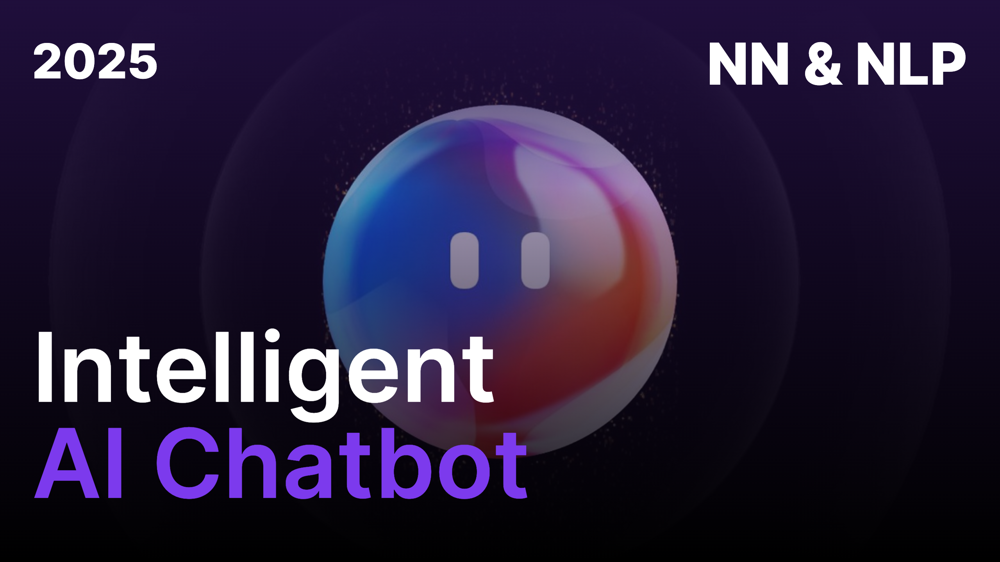

# 💬 Intelligent AI Chatbot (2025)



💬 This repository contains an intelligent chatbot powered by deep learning and natural language processing. The chatbot can understand user inputs, classify intents, and provide appropriate responses based on a trained model.

## ✨ Key Features

- 🧠 Neural network model with Keras/TensorFlow backend
- 📝 Natural Language Processing with NLTK
- 🔍 Intent classification and response generation
- 📊 Probability-based response selection
- 🏗️ Customizable training data (intents.json)

## 🛠️ Technical Stack

- 📦 Package management with pip
- 💬 NLP processing with NLTK
- 🧠 Deep learning with Keras
- 🔢 Numerical operations with NumPy
- 🏗️ Model architecture with TensorFlow

## 🚀 Getting Started

### Prerequisites

- Python 3.8+
- pip package manager

### Installation

1. Clone the repository:
```bash
git clone https://github.com/drackass/intelligent-ai-chatbot.git
cd intelligent-ai-chatbot
```

2. Create and activate a virtual environment (recommended):
```bash
python -m venv venv
source venv/bin/activate  # On Windows use: venv\Scripts\activate
```

3. Install dependencies:
```bash
pip install -r requirements.txt
```

4. Download NLTK data:
```bash
python -m nltk.downloader punkt wordnet
```

### Training the Model

Train the chatbot model with:
```bash
python training.py
```

This will:
- Process the intents.json file
- Create the training data
- Train and save the model (chatbot_model.keras)
- Generate words.pkl and classes.pkl files

### Running the Chatbot

Start the chatbot interface:
```bash
python chatbot.py
```

The chatbot will start in your terminal, ready to interact.

## 📂 Project Structure

```
intelligent-ai-chatbot/
├── chatbot.py          # Chatbot interaction script
├── training.py         # Model training script
├── intents.json        # Training data and responses
├── words.pkl           # Generated words vocabulary
├── classes.pkl         # Generated intent classes
├── chatbot_model.keras # Trained model
├── requirements.txt    # Python dependencies
├── README.md           # Project documentation
└── thumbnail.png       # Project thumbnail
```

## 📝 Customizing the Chatbot

To customize the chatbot's responses:

1. Edit the `intents.json` file to add new intents, patterns, and responses
2. Retrain the model by running `python training.py`
3. Restart the chatbot with `python chatbot.py`

Example intents.json structure:
```json
{
  "intents": [
    {
      "tag": "greeting",
      "patterns": ["Hi", "Hello", "Hey"],
      "responses": ["Hello!", "Hi there!", "Greetings!"]
    }
  ]
}
```

## ⚠️ Limitations

- The chatbot works best with short, clear sentences
- Performance depends on the quality and quantity of training data
- May struggle with complex queries or ambiguous language

## 📧 Contact

For questions or collaborations, please contact [leny.sauzet@gmail.com].